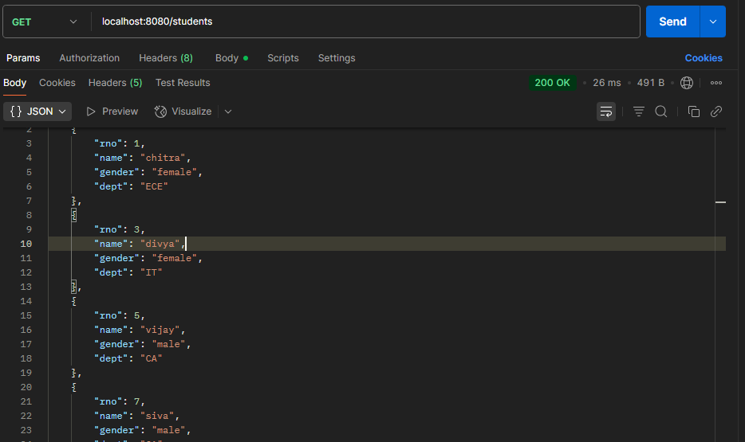
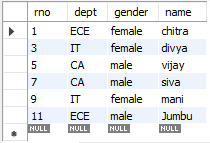

# 🧑‍🎓 Student CRUD API with Spring Boot, JPA & Hibernate

A simple backend project to manage student records using Spring Boot, Spring Data JPA, Hibernate, and MySQL.

---

## 🔧 Tech Stack

- Java
- Spring Boot
- Spring Data JPA
- Hibernate
- MySQL
- Postman (for testing)

---

## 📌 Features

- Add new student  
- View all students  
- Update student info  
- Delete individual or all students  
- Filter students by department or by gender + department

---

## ▶️ Endpoints

| Method | Endpoint                | Description                         |
|--------|-------------------------|-------------------------------------|
| `GET`  | `/students`             | Get all students                    |
| `GET`  | `/students/{rno}`       | Get student by roll number          |
| `POST` | `/students`             | Add a new student                   |
| `PUT`  | `/students`             | Update a student                    |
| `DELETE` | `/students/{rno}`     | Delete by roll number               |
| `DELETE` | `/students/clear`     | Delete all records                  |
| `GET`  | `/students/dept/{dept}` | Filter by department                |
| `POST` | `/students/filter`      | Filter by gender and department     |

---

## 📸 Preview

---

## 📚 Learnings

- Used **JPA** for replacing manual SQL with cleaner code  
- Understood how **Hibernate** handles object-relational mapping  
- Built custom queries with `@Query` and `@Param`  
- Explored REST API design with layered architecture

---

**Feel free to fork, star ⭐, or contribute!**

